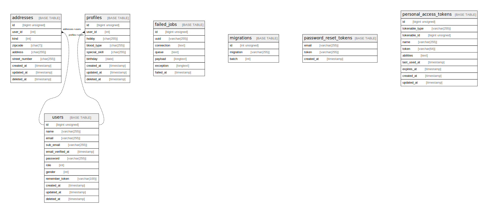

# pims_test

## Tables

| Name | Columns | Comment | Type |
| ---- | ------- | ------- | ---- |
| [addresses](addresses.md) | 9 | 住所マスタ | BASE TABLE |
| [failed_jobs](failed_jobs.md) | 7 |  | BASE TABLE |
| [migrations](migrations.md) | 3 |  | BASE TABLE |
| [password_reset_tokens](password_reset_tokens.md) | 3 |  | BASE TABLE |
| [personal_access_tokens](personal_access_tokens.md) | 10 |  | BASE TABLE |
| [profiles](profiles.md) | 9 | プロフィールマスタ | BASE TABLE |
| [users](users.md) | 12 | ユーザーマスタ | BASE TABLE |

## Relations

---

> Generated by [tbls](https://github.com/k1LoW/tbls)
