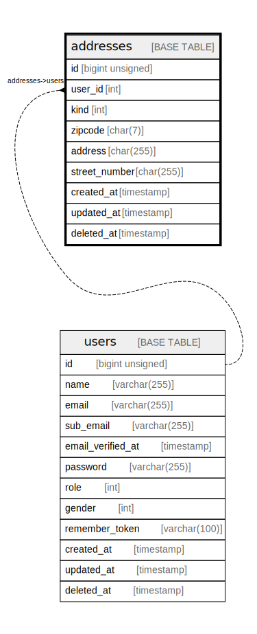

# addresses

## Description

住所マスタ

<details>
<summary><strong>Table Definition</strong></summary>

```sql
CREATE TABLE `addresses` (
  `id` bigint unsigned NOT NULL AUTO_INCREMENT,
  `user_id` int NOT NULL COMMENT 'ユーザーID',
  `kind` int NOT NULL COMMENT '住所種別',
  `zipcode` char(7) COLLATE utf8mb4_unicode_ci NOT NULL COMMENT '郵便番号',
  `address` char(255) COLLATE utf8mb4_unicode_ci NOT NULL COMMENT '住所',
  `street_number` char(255) COLLATE utf8mb4_unicode_ci NOT NULL COMMENT '丁目・番地・号',
  `created_at` timestamp NULL DEFAULT NULL,
  `updated_at` timestamp NULL DEFAULT NULL,
  `deleted_at` timestamp NULL DEFAULT NULL,
  PRIMARY KEY (`id`)
) ENGINE=InnoDB DEFAULT CHARSET=utf8mb4 COLLATE=utf8mb4_unicode_ci COMMENT='住所マスタ'
```

</details>

## Columns

| Name | Type | Default | Nullable | Extra Definition | Children | Parents | Comment |
| ---- | ---- | ------- | -------- | ---------------- | -------- | ------- | ------- |
| id | bigint unsigned |  | false | auto_increment |  |  | PrimaryKey |
| user_id | int |  | false |  |  | [users](users.md) | ユーザーID |
| kind | int |  | false |  |  |  | 住所種別 |
| zipcode | char(7) |  | false |  |  |  | 郵便番号 |
| address | char(255) |  | false |  |  |  | 住所 |
| street_number | char(255) |  | false |  |  |  | 丁目・番地・号 |
| created_at | timestamp |  | true |  |  |  | レコード作成日時 |
| updated_at | timestamp |  | true |  |  |  | レコード更新日時 |
| deleted_at | timestamp |  | true |  |  |  | レコードソフトデリート日時 |

## Constraints

| Name | Type | Definition |
| ---- | ---- | ---------- |
| PRIMARY | PRIMARY KEY | PRIMARY KEY (id) |

## Indexes

| Name | Definition |
| ---- | ---------- |
| PRIMARY | PRIMARY KEY (id) USING BTREE |

## Relations



---

> Generated by [tbls](https://github.com/k1LoW/tbls)
