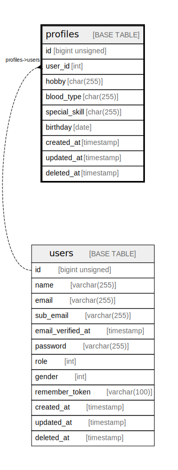

# profiles

## Description

プロフィールマスタ

<details>
<summary><strong>Table Definition</strong></summary>

```sql
CREATE TABLE `profiles` (
  `id` bigint unsigned NOT NULL AUTO_INCREMENT,
  `user_id` int NOT NULL COMMENT 'ユーザーID',
  `hobby` char(255) COLLATE utf8mb4_unicode_ci DEFAULT NULL COMMENT '趣味',
  `blood_type` char(255) COLLATE utf8mb4_unicode_ci DEFAULT NULL COMMENT '血液型',
  `special_skill` char(255) COLLATE utf8mb4_unicode_ci DEFAULT NULL COMMENT '特技',
  `birthday` date DEFAULT NULL COMMENT '生年月日',
  `created_at` timestamp NULL DEFAULT NULL,
  `updated_at` timestamp NULL DEFAULT NULL,
  `deleted_at` timestamp NULL DEFAULT NULL,
  PRIMARY KEY (`id`)
) ENGINE=InnoDB DEFAULT CHARSET=utf8mb4 COLLATE=utf8mb4_unicode_ci COMMENT='プロフィールマスタ'
```

</details>

## Columns

| Name | Type | Default | Nullable | Extra Definition | Children | Parents | Comment |
| ---- | ---- | ------- | -------- | ---------------- | -------- | ------- | ------- |
| id | bigint unsigned |  | false | auto_increment |  |  | PrimaryKey |
| user_id | int |  | false |  |  | [users](users.md) | ユーザーID |
| hobby | char(255) |  | true |  |  |  | 趣味 |
| blood_type | char(255) |  | true |  |  |  | 血液型 |
| special_skill | char(255) |  | true |  |  |  | 特技 |
| birthday | date |  | true |  |  |  | 生年月日 |
| created_at | timestamp |  | true |  |  |  | レコード作成日時 |
| updated_at | timestamp |  | true |  |  |  | レコード更新日時 |
| deleted_at | timestamp |  | true |  |  |  | レコードソフトデリート日時 |

## Constraints

| Name | Type | Definition |
| ---- | ---- | ---------- |
| PRIMARY | PRIMARY KEY | PRIMARY KEY (id) |

## Indexes

| Name | Definition |
| ---- | ---------- |
| PRIMARY | PRIMARY KEY (id) USING BTREE |

## Relations



---

> Generated by [tbls](https://github.com/k1LoW/tbls)
