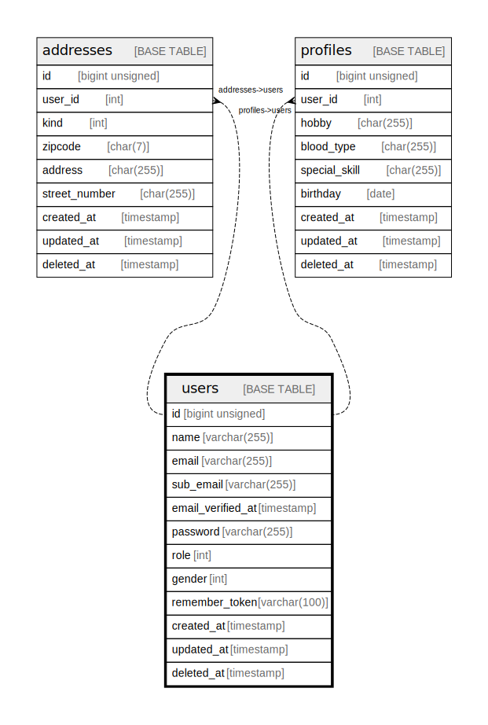

# users

## Description

ユーザーマスタ

<details>
<summary><strong>Table Definition</strong></summary>

```sql
CREATE TABLE `users` (
  `id` bigint unsigned NOT NULL AUTO_INCREMENT,
  `name` varchar(255) COLLATE utf8mb4_unicode_ci NOT NULL COMMENT '氏名',
  `email` varchar(255) COLLATE utf8mb4_unicode_ci NOT NULL COMMENT 'メールアドレス',
  `sub_email` varchar(255) COLLATE utf8mb4_unicode_ci NOT NULL COMMENT 'サブメールアドレス',
  `email_verified_at` timestamp NULL DEFAULT NULL,
  `password` varchar(255) COLLATE utf8mb4_unicode_ci NOT NULL COMMENT 'パスワード',
  `role` int NOT NULL DEFAULT '0' COMMENT '権限',
  `gender` int NOT NULL DEFAULT '0' COMMENT '性表現',
  `remember_token` varchar(100) COLLATE utf8mb4_unicode_ci DEFAULT NULL,
  `created_at` timestamp NULL DEFAULT NULL,
  `updated_at` timestamp NULL DEFAULT NULL,
  `deleted_at` timestamp NULL DEFAULT NULL,
  PRIMARY KEY (`id`),
  UNIQUE KEY `users_email_unique` (`email`),
  UNIQUE KEY `users_sub_email_unique` (`sub_email`)
) ENGINE=InnoDB DEFAULT CHARSET=utf8mb4 COLLATE=utf8mb4_unicode_ci COMMENT='ユーザーマスタ'
```

</details>

## Columns

| Name | Type | Default | Nullable | Extra Definition | Children | Parents | Comment |
| ---- | ---- | ------- | -------- | ---------------- | -------- | ------- | ------- |
| id | bigint unsigned |  | false | auto_increment | [addresses](addresses.md) [profiles](profiles.md) |  | PrimaryKey |
| name | varchar(255) |  | false |  |  |  | 氏名 |
| email | varchar(255) |  | false |  |  |  | メールアドレス |
| sub_email | varchar(255) |  | false |  |  |  | サブメールアドレス |
| email_verified_at | timestamp |  | true |  |  |  | メール承認日時 |
| password | varchar(255) |  | false |  |  |  | パスワード |
| role | int | 0 | false |  |  |  | 権限 |
| gender | int | 0 | false |  |  |  | 性表現 |
| remember_token | varchar(100) |  | true |  |  |  |  |
| created_at | timestamp |  | true |  |  |  | レコード作成日時 |
| updated_at | timestamp |  | true |  |  |  | レコード更新日時 |
| deleted_at | timestamp |  | true |  |  |  | レコードソフトデリート日時 |

## Constraints

| Name | Type | Definition |
| ---- | ---- | ---------- |
| PRIMARY | PRIMARY KEY | PRIMARY KEY (id) |
| users_email_unique | UNIQUE | UNIQUE KEY users_email_unique (email) |
| users_sub_email_unique | UNIQUE | UNIQUE KEY users_sub_email_unique (sub_email) |

## Indexes

| Name | Definition |
| ---- | ---------- |
| PRIMARY | PRIMARY KEY (id) USING BTREE |
| users_email_unique | UNIQUE KEY users_email_unique (email) USING BTREE |
| users_sub_email_unique | UNIQUE KEY users_sub_email_unique (sub_email) USING BTREE |

## Relations



---

> Generated by [tbls](https://github.com/k1LoW/tbls)
